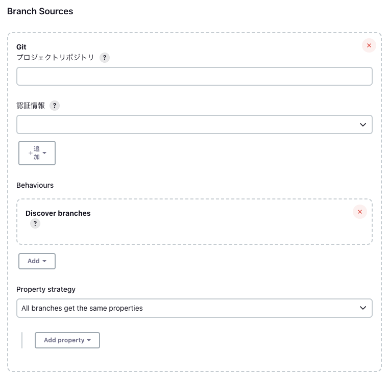
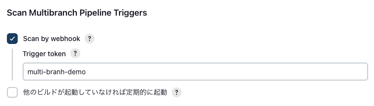
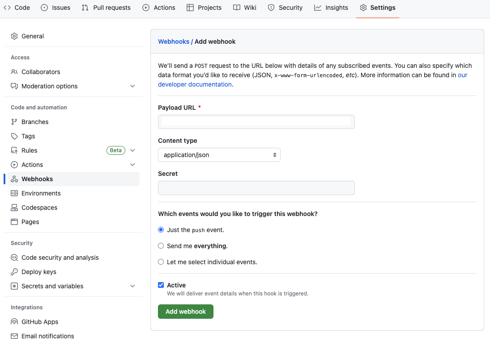

# MultiBranchPipelineDemo
マルチブランチパイプラインのデモ用プロジェクト
機能開発毎にブランチを切り、プッシュされたブランチのみジョブを実行させる。
*  branch構成
<pre>
master
    └ develop
        ├ featureA
        ├ featureB
        ・・・ 
</pre>

# Requirement
* dearpygui

# Jenkins側の設定
GitHubと連携する必要あるので、必要となるプラグインをインストールする。 

Plugins
* Git
* [Multibranch Scan Webhook Trigger](https://plugins.jenkins.io/multibranch-scan-webhook-trigger/)

ダッシュボードの新規ジョブ作成でMultibranch Pipelineを選択して作成する。以下、設定項目の詳細。 
1. Branh Sources 
    プロジェクトリポジトリには監視するリポジトリのリモートURL(HTTPS)を登録します。認証情報を登録する必要があるので、認証情報の追加をクリックし登録します。SSHユーザー名と秘密鍵で今回は登録を行いました。
    

1. Webhooksを登録(Jenkins側) 
    プラグインMultibranch Scan Webhook Triggerをインストールしていれば下図のようにwebhookをスキャンのトリガーとして使用できるようになっているはずです。好きにtoken名を設定して下さい。
    
   
1. Webhooksを登録(GitHub側) 
    Branch Sourcesに登録したリポジトリに移動し、Webhooksの設定を開きます。 
    Payload URLはJENKINS_URL/multibranch-webhook-trigger/invoke?token=TOKENHEREとなります。 
    JENKINS_URLはJenkinsサーバーのURL、TOKENHEREは前の手順で設定したtoken名となります。 
    その他の設定は、図の通りに設定して下さい。設定完了後、"Add webhook"ボタンを押してwebhookを登録して下さい。 
    以上の設定でリモートリポジトリへのプッシュでJenkinsのスキャンが開始されるはずです。
    

TODO: 設定方法を以下に記載
